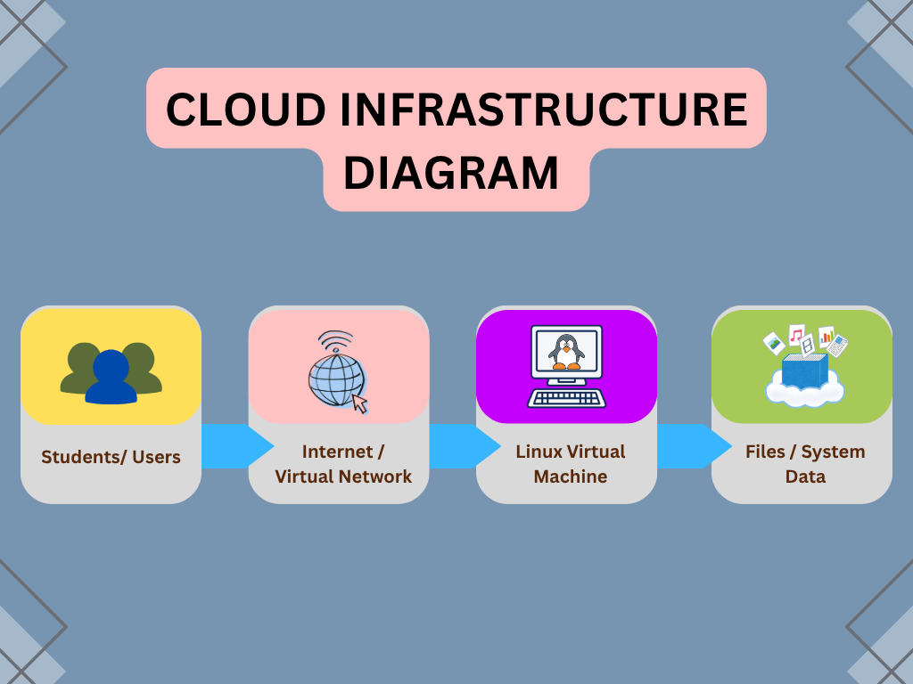

# Laboratory 02 – Build the Cloud Infrastructure Blueprint

## Objective

The objective of this activity is to investigate a Linux cloud environment, identify its infrastructure components, compare major cloud providers, and create a basic cloud infrastructure architecture.

## Cloud Infrastructure Components

The four main cloud infrastructure components identified are:

1. **Compute Resources** – Used to run applications, commands, and services.
2. **Storage Resources** – Used to store files, programs, system data, and other information.
3. **Networking Resources** – Allows computers, virtual machines, and services to communicate.
4. **Operating System** – Manages system resources and allows users to interact with the virtual machine.

## Cloud Provider Comparison

The three cloud providers compared are:

- **Amazon Web Services (AWS)**
- **Microsoft Azure**
- **Google Cloud Platform (GCP)**

They provide similar infrastructure services for compute, storage, networking, and operating systems.

## Cloud Architecture

The cloud infrastructure follows this basic flow:

**Users → Network → Compute → Storage**

The architecture diagram shows how users connect through a network to computing resources and storage resources.

## Key Findings

The KillerCoda investigation showed that the Linux environment uses Ubuntu 24.04.4 LTS with a single CPU core, 1.9 GiB of RAM, and a 19 GB main disk. The environment also has mounted file systems, a hostname, and IP addresses.

The activity demonstrated how compute, storage, networking, and operating system resources work together in a cloud environment.
