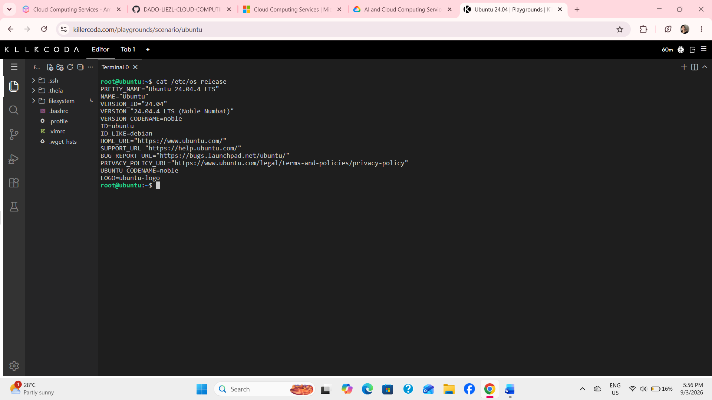
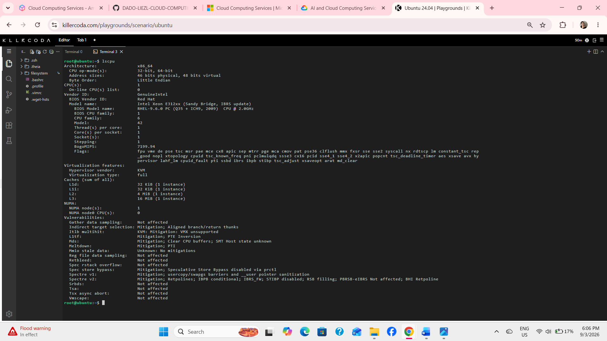
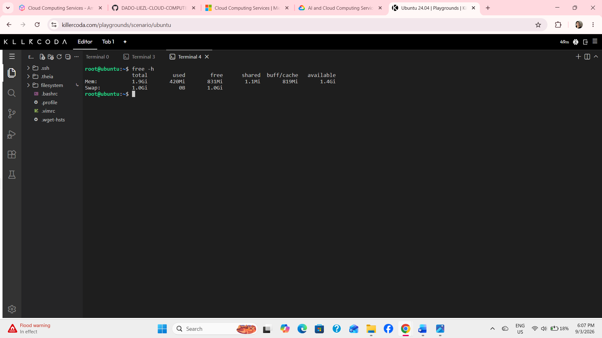
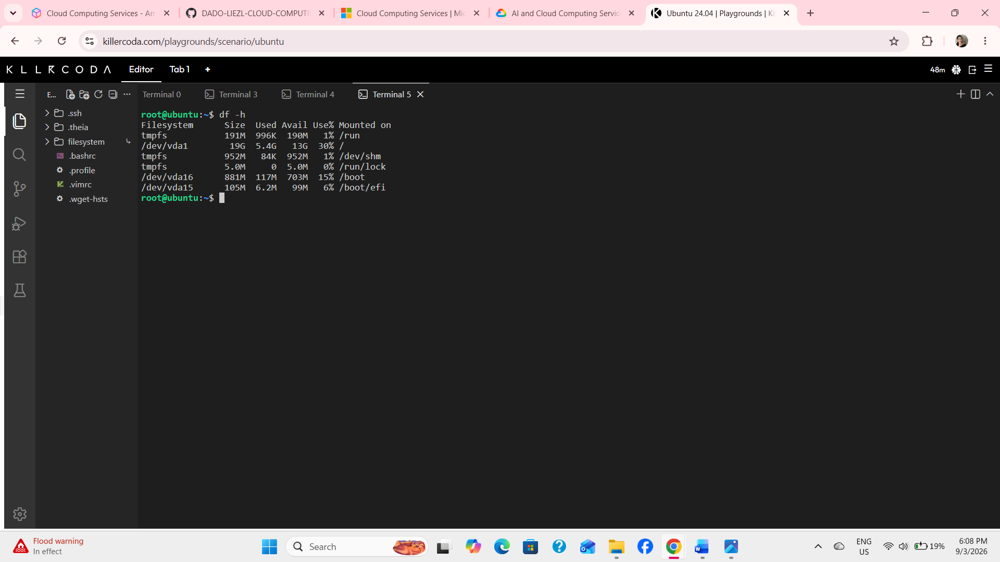

# Linux Investigation

## Linux Server Investigation

A KillerCoda Linux Playground was used to investigate a Linux server. Linux commands were used to identify the operating system, CPU information, memory, and disk space.

---

## 1. Operating System

The operating system was checked using:

`cat /etc/os-release`

### Result

- **Operating System:** Ubuntu
- **Version:** Ubuntu 24.04.4 LTS
- **Codename:** Noble Numbat
- **Version ID:** 24.04

---

## 2. CPU Information

The CPU information was checked using:

`lscpu`

### Result

- **Architecture:** x86_64
- **CPU(s):** 1
- **CPU Model:** Intel Xeon E312xx (Sandy Bridge, IBRS update)
- **CPU Family:** 6
- **Core(s) per socket:** 1
- **Socket(s):** 1
- **Virtualization:** KVM

The Linux server is running with one virtual CPU based on an Intel Xeon processor.

---

## 3. Memory

The memory information was checked using:

`free -h`

### Result

- **Total Memory:** 1.9 GiB
- **Used Memory:** approximately 420 MiB
- **Free Memory:** approximately 831 MiB
- **Available Memory:** approximately 1.4 GiB
- **Swap:** 1.0 GiB

The memory values can change slightly while the server is running. The latest result showed approximately 1.9 GiB of total memory.

---

## 4. Disk Space

The disk space was checked using:

`df -h`

### Result

The main filesystem is:

- **Filesystem:** /dev/vda1
- **Total Size:** 19 GB
- **Used:** 5.4 GB
- **Available:** 13 GB
- **Usage:** 30%
- **Mounted on:** /

There are also separate partitions for `/boot` and `/boot/efi`.

---

# Cloud Migration

If this Linux server were migrated to the cloud, it could be hosted using virtual machine services from AWS, Azure, or GCP.

| Cloud Provider | Service | Purpose |
| --- | --- | --- |
| AWS | Amazon EC2 | Provides virtual machines for running Linux servers and applications. |
| Azure | Azure Virtual Machines | Provides cloud-based virtual machines that can run Linux operating systems. |
| GCP | Compute Engine | Provides configurable virtual machines for running Linux workloads. |

## AWS — Amazon EC2

**Amazon EC2 (Elastic Compute Cloud)** could host this Ubuntu Linux server as a virtual machine. The CPU, memory, storage, and networking resources can be configured according to the server's requirements.

## Azure — Azure Virtual Machines

**Azure Virtual Machines** could host the Ubuntu Linux server in Microsoft Azure. Azure supports Linux operating systems and provides different virtual machine sizes that can be selected based on the required CPU, memory, and storage.

## GCP — Compute Engine

**Google Compute Engine** could also host the Ubuntu Linux server. It provides configurable virtual machines that can run Linux operating systems and applications.

---

# Cloud Service Comparison

| Requirement | AWS | Azure | GCP |
| --- | --- | --- | --- |
| Linux Hosting | Amazon EC2 | Azure Virtual Machines | Compute Engine |
| Virtual CPU | Configurable | Configurable | Configurable |
| Memory | Configurable | Configurable | Configurable |
| Storage | Amazon EBS | Azure Managed Disks | Persistent Disk |
| Networking | Amazon VPC | Azure Virtual Network | Virtual Private Cloud (VPC) |

---

# Conclusion

The KillerCoda server is running Ubuntu 24.04.4 LTS with an x86_64 architecture, one CPU, approximately 1.9 GiB of memory, and a 19 GB main disk.

If the server were migrated to the cloud, **Amazon EC2, Azure Virtual Machines, or Google Compute Engine** could be used to host the Linux environment. All three cloud platforms support Linux virtual machines and allow computing, memory, storage, and networking resources to be configured according to the workload requirements.
