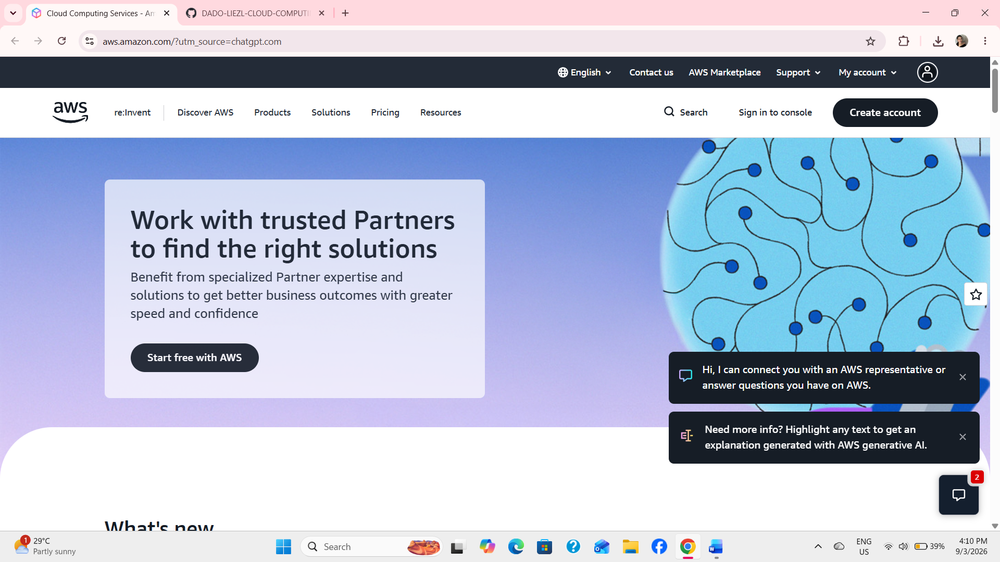

# AWS Research

## 1. Brief Overview

Amazon Web Services (AWS) is a cloud computing platform provided by Amazon. It offers many services that allow individuals, businesses, and organizations to use computing resources through the internet instead of buying and maintaining their own physical servers. AWS provides services for computing, storage, databases, networking, security, and more.

## 2. Global Infrastructure

AWS has a global infrastructure made up of **Regions, Availability Zones, and data centers**. A Region is a geographic area where AWS provides cloud services. Each Region contains multiple Availability Zones, which are separate locations designed to provide reliability and availability. This global infrastructure allows businesses to deploy applications closer to their users and reduce the risk of service interruptions.

## 3. Cloud Management Console

The **AWS Management Console** is a web-based interface used to manage AWS services and resources. Users can log in through a web browser and create, configure, monitor, and manage resources such as virtual servers, storage, databases, and networks. It provides a graphical interface, making it easier to manage cloud resources without using only command-line tools.

## 4. Four Core Services

1. **Amazon EC2 (Elastic Compute Cloud)** – Provides virtual servers that can be used to run applications and websites.
2. **Amazon S3 (Simple Storage Service)** – Provides scalable cloud storage for files, images, videos, backups, and other data.
3. **Amazon RDS (Relational Database Service)** – Provides managed relational databases that can store and organize application data.
4. **Amazon VPC (Virtual Private Cloud)** – Allows users to create and manage a private network environment for their AWS resources.

## 5. Three Advantages

1. **Scalability** – AWS allows businesses to increase or decrease their computing resources depending on their needs.
2. **Cost Efficiency** – Users can pay for the cloud resources they use instead of purchasing and maintaining expensive physical infrastructure.
3. **Global Availability** – AWS has infrastructure in different parts of the world, allowing applications and services to be deployed closer to users.

## 6. Typical Enterprise Use Cases

Enterprises use AWS for many different purposes, including **hosting websites and applications, storing and backing up data, running databases, analyzing large amounts of data, developing and testing software, and supporting business applications**. Companies can also use AWS to build scalable systems without having to maintain their own physical data centers.

## 7. Screenshot

