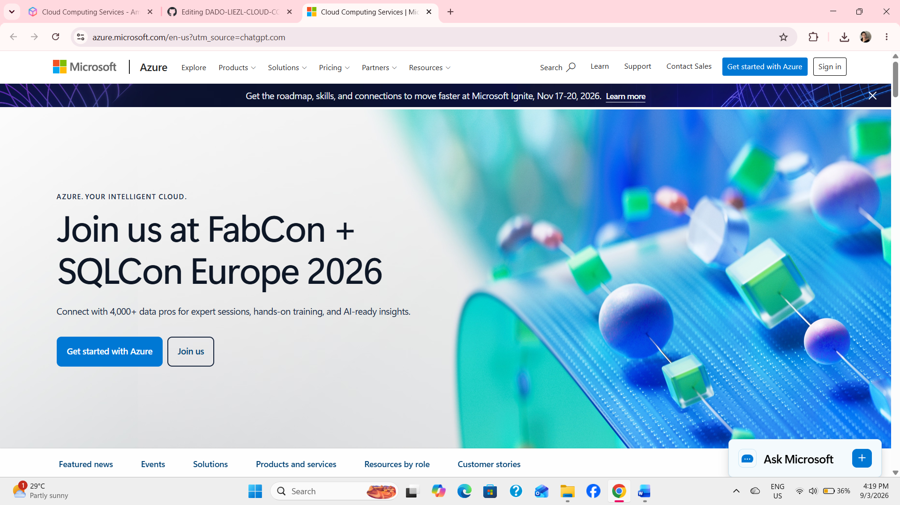

# Microsoft Azure Research

## 1. Brief Overview

Microsoft Azure is a cloud computing platform developed by Microsoft. It provides cloud services that organizations can use to build, deploy, manage, and scale applications and IT infrastructure. Azure supports different types of workloads, including Windows and Linux applications, databases, networking, artificial intelligence, and containers.

## 2. Global Infrastructure

Azure has a global infrastructure made up of regions, datacenters, geographies, and availability zones. Microsoft provides Azure infrastructure across many locations around the world, allowing organizations to place applications and data closer to their users. This global infrastructure helps support performance, availability, data residency, and disaster recovery requirements.

## 3. Cloud Management Console

The Azure portal is the web-based management console used to manage Azure resources and services. Through the portal, users can create and manage virtual machines, storage, databases, networks, security settings, and other cloud resources. It provides a graphical interface that helps administrators monitor and control their Azure environment.

## 4. Four Core Services

1. **Azure Virtual Machines** – Provides virtualized computing resources for running Windows and Linux applications in the cloud.
2. **Azure Blob Storage** – Provides scalable object storage for data, files, archives, data lakes, and other workloads.
3. **Azure Virtual Network** – Provides private network infrastructure for connecting and securing applications and virtual machines.
4. **Microsoft Entra ID** – Provides identity and access management for users and applications.

## 5. Three Advantages

1. **Strong Microsoft Integration** – Azure works closely with Microsoft technologies such as Windows Server, Microsoft 365, SQL Server, and Microsoft Entra ID.
2. **Global Infrastructure** – Azure provides infrastructure in many regions around the world, helping organizations serve users globally and meet data residency requirements.
3. **Scalability and Flexibility** – Azure allows organizations to deploy and scale computing, storage, networking, and application resources according to their needs.

## 6. Typical Enterprise Use Cases

Azure is commonly used by enterprises for application hosting, Windows Server migration, databases, hybrid cloud environments, data analytics, artificial intelligence, and business applications. It is also useful for organizations that already depend heavily on Microsoft technologies because Azure provides integration with existing Microsoft environments.

## 7. Screenshot

