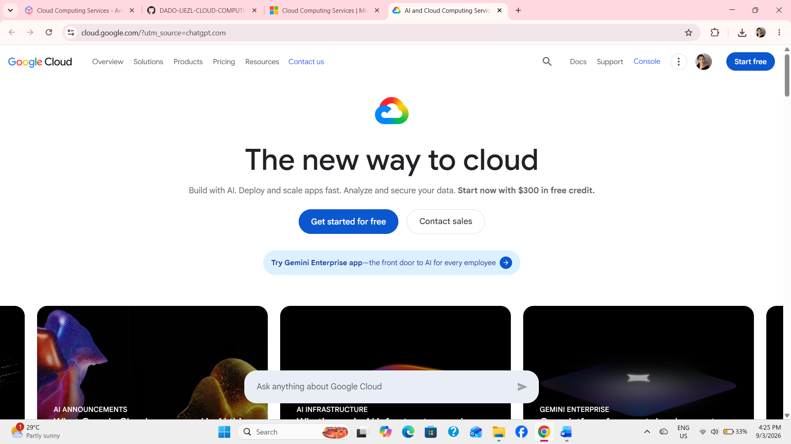

# Google Cloud Research

## 1. Brief Overview

Google Cloud is a cloud computing platform developed by Google. It provides services that organizations and developers can use to build, deploy, manage, and scale applications and IT infrastructure. Google Cloud offers services for computing, storage, databases, networking, data analytics, artificial intelligence, and application development.

## 2. Global Infrastructure

Google Cloud has a global infrastructure made up of regions and zones located around the world. Regions are geographic areas, while zones are separate locations within a region. This infrastructure allows organizations to place their applications and resources closer to their users, helping improve performance, availability, and reliability. Google Cloud also uses its global network to connect its infrastructure across different locations.

## 3. Cloud Management Console

The Google Cloud Console is a web-based management interface used to create, manage, and monitor Google Cloud resources and services. Users can manage virtual machines, storage, databases, networks, security settings, and other cloud resources through the console. Google Cloud also provides Cloud Shell and the Google Cloud CLI for users who prefer command-line management.

## 4. Four Core Services

1. **Compute Engine** – Provides virtual machines that can be used to run applications and workloads in the cloud.
2. **Cloud Storage** – Provides scalable object storage for files, backups, archives, and other types of data.
3. **Cloud SQL** – Provides managed relational databases such as MySQL, PostgreSQL, and SQL Server.
4. **Virtual Private Cloud (VPC)** – Provides networking capabilities for connecting and securing cloud resources and applications.

## 5. Three Advantages

1. **Global Infrastructure** – Google Cloud provides infrastructure in many regions and zones around the world, allowing organizations to serve users from different locations.
2. **Scalability** – Google Cloud allows organizations to increase or decrease their cloud resources based on workload requirements.
3. **Strong Data and AI Capabilities** – Google Cloud provides powerful services for data analytics, machine learning, and artificial intelligence.

## 6. Typical Enterprise Use Cases

Enterprises use Google Cloud for application hosting, virtual machines, data storage, databases, data analytics, artificial intelligence, machine learning, and application development. Organizations can also use Google Cloud to build scalable applications and manage workloads across different regions. Its services are useful for businesses that need flexible cloud infrastructure and advanced data and AI capabilities.

## 7. Screenshot

